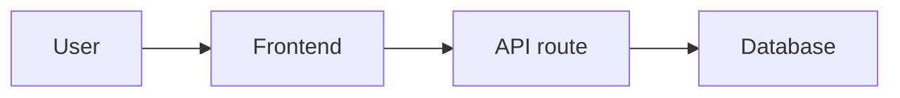

# Docs Style Reference

This reference defines the editorial and verification standard for README.md, README-vi.md, and `/docs/**`.

## 1. Target Standard

The target is not a pretty template. The target is documentation that proves the writer understands the project.

Strong project documentation should:

- explain the product/domain before naming implementation details
- describe the real runtime system, not an idealized version
- connect technical decisions to business rules, user flows, data constraints, or operational pressure
- name current limitations without making the project look unfinished by accident
- distinguish active code paths from old experiments, unused adapters, archived setup files, and migration leftovers
- keep source evidence available without making the reader parse a file inventory

The closest benchmark is a strong project spec such as `vhdg-conhon/SPECS.md`: it has a concrete domain, important technical challenges, design reasons, database shape, business logic, API surface, page surface, and appendices. For other repos, match that depth in the repo's own context. Do not copy its exact structure blindly.

A good result must also look organized on GitHub. Documentation is not only text correctness; it is reading design. Heading rhythm, badge placement, screenshot size, table density, and diagram shape all affect whether a human trusts and finishes the document.

The highest bar is "why-first technical literature": every major section should answer why the system exists, why the design is shaped this way, what breaks when assumptions fail, and how a maintainer should think before changing it.

## 1.1 Enforcement Standard

Treat documentation work as implementation work. A docs rewrite is not done when files have been edited; it is done when the written system model is defensible against source, runtime behavior, and GitHub rendering.

Required enforcement:

- Write only after source study. If source study is incomplete, say what was not inspected instead of implying full understanding.
- Prefer one strong technical spec over many thin files. Split only when each file carries a distinct reader job.
- When current code contains old providers, old folders, copied configs, or partially deleted features, document the active path first and legacy traces second.
- If screenshots are requested, verify the image file locally and ensure the Markdown path will render on GitHub.
- If badges are used, verify every badge is active stack. Dependencies alone are not evidence.
- If a repo is a profile, rules repo, demo, or library, adapt the shape. Do not force product-app docs onto a non-product repo.
- Do not stop at "what". Every important section needs a "why", a failure mode, and a maintainer implication.

The strongest docs create confidence through specificity: a reader should understand not only what exists, but why the system would fail if a key boundary, transaction, provider, or operational assumption is handled casually.

## 2. Repository Classification

Classify first. The documentation shape follows the project type.

| Repo type | README focus | Deep docs focus |
|---|---|---|
| Full product/app | product, users, live state, capabilities, tech stack, run path | architecture, workflows, data, integrations, operations, risks |
| Frontend-only app | user experience, pages, state model, assets, build/deploy | routing, component structure, content model, API assumptions, screenshots |
| Backend/API | domain, API responsibilities, data model, integration contracts | endpoints, schemas, auth, jobs, error handling, observability |
| Library/tooling | problem solved, install/use, API or CLI surface | internals, extension points, compatibility, failure modes |
| Agent/rules repo | runtime model, load order, rule precedence, sync model | skills, hooks, tools, bootstrap, context policy, operational guardrails |
| Data/AI project | input/output, model/provider, data flow, evaluation | prompts, embeddings, provider switch history, validation, fallback |
| Profile repo | identity and selected links | usually no deep docs unless explicitly requested |
| Demo/prototype | what is real, what is mocked, what is intentionally incomplete | setup, assumptions, next production steps |

If a repo is mixed, document the dominant product first and the supporting tooling second.

## 3. Source Study Checklist

Before rewriting, inspect enough source to defend every important claim.

Minimum inspection:

- Manifests and package managers: `package.json`, `pnpm-lock.yaml`, `package-lock.json`, `yarn.lock`, `requirements.txt`, `pyproject.toml`, `go.mod`, `pubspec.yaml`, etc.
- Entry points: `src/main.*`, `src/App.*`, `app/**`, `pages/**`, server bootstrap, CLI entry, worker entry.
- Routing/API: controllers, route handlers, server actions, API folders, RPC/tool maps.
- Data layer: models, migrations, schemas, SQL, ORM config, seed files, storage adapters.
- Auth and permissions: middleware, guards, session/JWT providers, role checks.
- Integrations: AI providers, payments, email, object storage, CMS, analytics, external APIs.
- Runtime config: `.env.example`, Docker, Compose, Vercel, Cloudflare, Pages, Nginx, GitHub Actions.
- UI surface: home/landing, dashboard, admin, forms, public pages, screenshots, live URLs.
- Tests/scripts: test, lint, build, seed, deploy, maintenance commands.

Keep private notes while reading:

```text
Claim: active AI provider is OpenRouter.
Evidence: src/lib/ai/openrouter.ts is imported by src/app/api/chat/route.ts.
Legacy trace: src/lib/ai/cloudflare.ts exists but is not imported by active route.
Doc wording: "OpenRouter is the active provider; a Cloudflare Worker AI adapter remains as a legacy trace."
```

Only the final wording belongs in docs. The evidence note is for the writer.

## 4. Fact Discipline

Use four labels internally:

| Label | Meaning | Documentation treatment |
|---|---|---|
| Current | active path imported or used at runtime | write as present behavior |
| Legacy | old code/config remains but is not active | label as legacy trace |
| Planned | TODO/roadmap or partially wired feature | put in limitations/roadmap |
| Unknown | cannot prove from source | omit or mark `TODO: xác minh ...` |

Do not use ambiguous wording such as "supports X" when X is only a dependency, unused component, stale branch, or config leftover.

## 5. Editorial Thesis and Reader Journey

Every serious README or technical spec needs a thesis. The thesis is the controlling idea that makes the document more than a list.

Good thesis examples:

```md
This system digitizes a seasonal folk-game workflow where the hard problem is not rendering a grid, but protecting session capacity, payment state, draw timing, and admin control under a short high-traffic operating window.
```

```md
This rules repo is a runtime control layer for agents. Its value is not in one prompt file, but in how it orders rules, skills, local overrides, tool inventory, and sync boundaries so multiple agents can behave consistently across machines.
```

Weak thesis examples:

```md
This is a fullstack application built with React and Node.js.
```

```md
This repo contains rules and documentation.
```

Reader journey:

1. Identity: what is this project?
2. Domain pressure: what real constraint makes it non-trivial?
3. System shape: how is it divided?
4. Core decisions: why were the main choices made?
5. Data/workflow: how does state move?
6. Failure: where can it break?
7. Operation: how do maintainers run, debug, and change it?
8. Future: what should be improved next?

If a document jumps straight from project name to commands, it is usually too shallow for a serious repo.

## 6. README.md and README-vi.md

README is the front door. It should be short enough to read, but specific enough to establish credibility.

Recommended structure:

```md
# Project Name

One direct paragraph: what it is, who it serves, and current state.

## Preview

Verified screenshot or live URL if available.

## What it does

Concrete capabilities, written as product behavior.

## Technical shape

Short architecture explanation and verified stack.

## Why it is built this way

Only the 2-4 decisions that matter.

## Run locally

Minimal commands that match scripts/config.

## Read next

Links to the most useful docs.
```

Rules:

- `README-vi.md` may be primary for Vietnamese projects.
- `README.md` and `README-vi.md` must describe the same current facts.
- Do not overload README with every endpoint, table, component, or migration.
- Do not add shield badges unless every badge is verified.
- Do not include broken screenshots. If no valid image exists, omit the image and say where screenshots should be added later only when useful.

## 7. Visual Presentation and Tech Badges

README should have a deliberate visual surface on GitHub. It should not look like raw notes.

Recommended visual order:

```md
# Project Name — Short, concrete category


Live: https://...

One or two strong paragraphs.

## Preview


## What it does
...

## Tech Stack
...
```

### Badge rules

Use Shields.io badges for stack items when the project has a clear stack.

Preferred format:

```md

```

Rules:

- Use `style=flat-square`.
- Use real logos when Shields.io supports them.
- Use readable brand colors or high-contrast neutral colors.
- Keep header badges to primary stack items only: framework, language, runtime, database/cache, deploy/runtime.
- Put detailed stack in a table by layer.
- Do not use a badge for a stale dependency, old adapter, copied config, or unused package.
- Do not add 20 badges in the header. If it wraps into a noisy block, move details to the stack table.
- Badges must render on GitHub. Broken badge URLs fail the docs.

### Layered tech stack table

Use a table like this for substantial apps:

```md
## Tech Stack

| Layer | Stack |
|---|---|
| Frontend |    |
| Backend |   |
| AI |  |
| Auth |  |
| Data Fetching |  |
```

Layer table rules:

- Layer names must reflect the real architecture.
- Each stack item must be verified from source.
- If a layer is absent, omit it.
- If a layer is legacy only, mark it as legacy in prose below the table instead of presenting it as active.
- Do not mix active and legacy providers in the same row without labels.

### Badge color guidance

Use stable, recognizable colors:

| Stack | Badge color |
|---|---|
| React | `61DAFB` |
| TypeScript | `3178C6` |
| JavaScript | `F7DF1E` with dark text only if manually handled; otherwise use neutral |
| Vite | `646CFF` |
| Next.js | `000000` |
| Tailwind CSS | `38B2AC` |
| Node.js | `339933` |
| NestJS | `E0234E` |
| Express | `000000` |
| PostgreSQL | `4169E1` |
| SQLite/D1 | `003B57` |
| Redis | `DC382D` |
| Docker | `2496ED` |
| Nginx | `009639` |
| Cloudflare | `F38020` |
| Vercel | `000000` |
| JWT | `000000` |
| Prisma | `2D3748` |
| Supabase | `3ECF8E` |
| Firebase | `FFCA28` |
| OpenRouter | `111111` |
| Workers AI | `F38020` |

The exact color can vary, but the badge set must look coherent.

## 8. Technical Specification Depth

For non-trivial repos, create or maintain a deep technical specification. It can be `SPECS.md` at root if the repo already uses that style, or a clear `/docs` file such as:

```text
docs/
  01-technical-specification.md
```

The spec should be deep enough that a new maintainer can understand the system before opening source.

Minimum sections for a full app:

1. Overview: product, domain, users, current status.
2. Domain model: key entities, rules, state transitions, terms.
3. Technical challenges: race conditions, provider failures, auth, data consistency, latency, deployment constraints.
4. Architecture: runtime pieces and why they exist.
5. Tech stack: verified layer table with badges or compact names.
6. Data model: schema, important tables/collections, indexes, constraints, storage ownership.
7. Business logic: main workflows with normal path and failure path.
8. API/reference surface: grouped routes/endpoints/actions, not every trivial handler unless useful.
9. UI/page surface: public, user, admin, or operator screens.
10. Operations: env, local run, deployment, logs, maintenance.
11. Limitations and roadmap: current gaps, risks, and concrete next work.

Add these when relevant:

12. Decision log: important decisions, alternatives rejected, tradeoffs.
13. Operational playbook: common incidents, symptoms, checks, recovery.
14. Change safety notes: what must be verified before touching core flows.
15. Glossary/domain appendix: project-specific terms that cannot be inferred from code.

For smaller repos, compress the same thinking into fewer sections. Do not write a shallow spec just to satisfy a file name.

Strong spec writing pattern:

```md
## Race condition in purchase limits

The risk appears when two requests attempt to reserve the same remaining capacity at the same time. The system must treat the reservation as an atomic operation; otherwise the UI can show a valid slot while the backend has already accepted another request.

Current handling: ...

Why this matters: ...

Where to verify: ...
```

Avoid:

```md
## Race Condition

The project may have race conditions. Need to optimize.
```

## 9. Design Decision Standard

Every important technical decision should be written as a mini-argument.

Template:

```md
### Decision: [Name]

**Problem:** What pressure forced a decision?

**Chosen approach:** What is the current design?

**Why this works here:** Why does it fit this repo's domain, traffic, team, cost, or deployment model?

**Rejected alternatives:** What was not chosen, and why?

**Tradeoff:** What became harder because of this choice?

**Revisit when:** What future condition may invalidate the decision?
```

Good decisions are specific:

- "SSE instead of WebSocket because the app only needs server-to-client updates."
- "PostgreSQL instead of MongoDB because order/session state needs ACID and row-level locking."
- "Docker Compose instead of Kubernetes because the app is seasonal and expected load does not justify cluster complexity."

Bad decisions are generic:

- "React was chosen because it is popular."
- "Docker is used for scalability."
- "PostgreSQL is robust."

## 10. Operating Reality

High-end docs show how the system behaves when reality is imperfect.

Include operating reality when applicable:

- concurrency: simultaneous writes, oversell, duplicate actions
- idempotency: repeated webhook, retry, double-submit
- payment expiry: reserved state that must be released
- provider failure: AI/payment/email/storage outages
- auth and permission: role boundaries, admin-only actions, guest/user split
- deployment split: CDN, reverse proxy, container, worker, database
- stale data: cache TTL, invalidation, optimistic UI, polling/SSE
- manual recovery: admin correction, database check, log path, replay path
- seasonal/traffic pattern: launch windows, peak hours, low-traffic periods

Write this as practical documentation, not fear-driven warnings.

Example:

```md
Payment expiry is not a UI detail. It protects capacity from being reserved forever by abandoned orders. The system must either receive a cancellation signal or run a cleanup path that releases reserved capacity after the payment window.
```

## 11. Professional Information Architecture

Organize docs by reader need, not by what files happened to exist.

Recommended reader paths:

| Reader | First read | Then read |
|---|---|---|
| New maintainer | README, technical spec | operations, risks |
| Product/domain reviewer | README, domain rules, workflows | page overview |
| Backend developer | architecture, data model, API, workflows | operations |
| Frontend developer | README, UI/page overview, API contract | screenshots, state model |
| Operator/admin | operations, incidents, deployment | risks |
| Future agent | README, spec, source anchors | TODO/unknown facts |

Documentation folder rules:

- Put the strongest system explanation first.
- Keep operational docs separate from conceptual docs when both are substantial.
- Keep appendices for reference tables, constants, route lists, or domain lists.
- Do not create `01-start-here.md` if README already performs that role well.
- Do not split a coherent spec into many files only to satisfy a template.

## 12. /docs Organization

Use `/docs` for depth. Prefer fewer strong files over many thin files.

Default product/app map:

```text
docs/
  01-product-and-domain.md
  02-architecture.md
  03-data-and-integrations.md
  04-workflows.md
  05-operations.md
  06-risks-and-roadmap.md
  assets/
```

Default tooling/agent map:

```text
docs/
  01-runtime-model.md
  02-installation-and-sync.md
  03-rule-and-skill-system.md
  04-tooling-and-automation.md
  05-maintenance-and-risks.md
```

Default API/backend map:

```text
docs/
  01-domain-and-contracts.md
  02-architecture.md
  03-api-and-auth.md
  04-data-model.md
  05-operations.md
  06-risks-and-roadmap.md
```

Use another map when the repo demands it. The reading order must remain clear.

## 13. What Deep Docs Must Contain

Architecture docs should explain:

- system boundary
- runtime pieces
- data stores
- external services
- active deployment path
- why the chosen shape fits the project
- what would break first under load or failure

Workflow docs should explain:

- trigger
- normal path
- failure path
- persistence or side effects
- user/admin/system-visible result
- retry, rollback, fallback, or manual recovery where relevant

Operations docs should explain:

- local run commands
- build/deploy path
- environment variables
- logs and debugging
- known failure modes
- what not to touch casually

Risks/roadmap docs should explain:

- current limitations
- why they matter
- evidence from source or runtime
- reasonable next work
- tradeoffs, not wishlists

## 14. Diagrams

Use diagrams only when they clarify a real structure or flow.

Good diagram qualities:

- names the real system pieces
- shows direction of data or control
- stays small enough to verify
- is followed by explanation

Use Mermaid when GitHub rendering helps, otherwise use plain text. Avoid decorative diagrams.

Example:



After the diagram, explain the important boundary:

```md
The frontend owns form state and validation feedback. The API route owns persistence and external provider calls, so provider failures should be handled there instead of leaking provider-specific behavior into UI components.
```

## 15. Screenshots and Assets

Screenshot rules:

- Use live screenshots when a live URL exists and the user asks for visual proof.
- Use Playwright or a real browser capture for web apps when possible.
- Store docs images under `/docs/assets/` or a project's existing docs asset folder.
- Link screenshots with paths that render on GitHub.
- Verify the file exists after moving or renaming.
- Do not include placeholder screenshots, broken links, or images from another project.
- Prefer one strong homepage/landing screenshot plus 1-2 workflow/admin screenshots when available and safe.
- Keep screenshot filenames descriptive: `homepage.png`, `admin-dashboard.png`, `checkout-flow.png`.

For admin screenshots, avoid leaking sensitive data. Use demo/local data or crop/redact if needed.

## 16. Tech Stack Accuracy

Tech stack must come from source:

- Frameworks from manifests and entry points.
- Database from schema/config/client usage.
- AI provider from active call path, not stale adapter files.
- Deployment from actual config and repository settings when available.
- Styling from config/imports/components, not visual guess.

Write nuanced stack statements:

- Good: "The app is a Next.js project using Prisma with PostgreSQL; the Docker setup also provisions Redis for queue/cache behavior."
- Bad: "Modern fullstack app with AI, database, and scalable backend."

## 17. Document Aesthetics

Documentation should be visually controlled:

- Use one H1 per file.
- Use short H2 headings that describe the section.
- Avoid deep nesting beyond H3 unless the spec genuinely needs it.
- Prefer compact tables for stack, routes, pages, and decisions.
- Avoid wide tables that force horizontal scrolling.
- Put screenshots near the sections they explain.
- Leave enough whitespace between major sections.
- Use code blocks only for commands, config examples, API examples, or diagrams.
- Use blockquotes only for warnings, TODOs, or operational notes.

Bad aesthetics:

- long unbroken paragraphs
- repeated generic section headings
- badge walls
- screenshot links that render as broken icons
- huge diagrams that cannot be read on GitHub
- many tiny docs files with 10-20 lines each

Good aesthetics:

- strong README header
- small verified badge row
- one clean preview image
- layered stack table
- purposeful diagrams
- deep spec sections with concrete examples

## 18. Stronger Communication

Professional docs can be inspiring without becoming marketing copy. The rule is: inspiration must come from clarity, specificity, and stakes.

Use:

- domain stakes: why the project matters in its setting
- engineering stakes: what can go wrong if implemented poorly
- design confidence: why the chosen shape is appropriate
- maintained restraint: no hype, no vague greatness

Strong:

```md
The hard part is not displaying the animal grid; it is preserving trust in a short seasonal window where many users act at the same time and every accepted order must map to a consistent payment, capacity, and draw result.
```

Weak:

```md
This is a powerful and modern platform with a robust architecture.
```

Use rhythm:

1. Short statement of the problem.
2. Concrete failure if it is handled badly.
3. Current design.
4. Tradeoff.
5. Where to verify or how to operate it.

## 19. Cleanup Rules

When organizing docs:

- Move useful scattered markdown into `/docs`.
- Merge files that repeat the same setup or architecture content.
- Delete obsolete task files only when their content is superseded or stale.
- Keep migration notes only if they still explain current production state or historical decisions.
- Put raw images, exported screenshots, and visual assets under `/docs/assets/`.
- Do not touch core source files during docs cleanup unless the user explicitly asks.

If deleting a file, know why:

| Delete reason | Allowed? |
|---|---|
| Duplicated by newer docs | yes |
| Stale setup that contradicts current scripts | yes, after preserving needed facts |
| Temporary migration checklist already completed | yes |
| Only because the folder looks cluttered | no |
| You did not read it | no |

## 20. Tone and Language

Use Vietnamese with full diacritics for Vietnamese docs.

Preferred style:

- direct
- specific
- edited
- calm
- technically literate
- domain-aware

Avoid:

- chat tone
- sales tone
- beginner tutorial tone
- internal reasoning tone
- excessive code/path references
- "có vẻ", "dường như", "mình thấy" in final docs

Use English technical terms when they are the natural term: `route`, `middleware`, `schema`, `migration`, `webhook`, `queue`, `worker`, `cache`, `provider`, `deployment`. Explain only when needed.

## 21. Good vs Bad Writing

Bad:

```md
The project has frontend and backend folders. The frontend contains components and pages. The backend has routes and services. There is also Docker.
```

Good:

```md
The product is split into a browser-facing client and a backend API because the UI needs fast iteration while payment, persistence, and administrative actions must stay server-side. Docker is used to keep the local runtime close to deployment: the app, database, and supporting services start with one command instead of relying on manually installed services.
```

Bad:

```md
AI is handled by multiple providers.
```

Good:

```md
OpenRouter is the active AI provider in the chat request path. A Cloudflare Worker AI adapter still exists in the repository as a legacy trace, but it is not part of the current runtime unless the route imports it again.
```

## 22. Regression Traps

These are the outputs that caused the previous documentation quality failure. Treat them as hard regressions.

### Trap 1: Source inventory instead of explanation

Bad:

```md
The frontend is in `src`, the backend is in `backend`, and Docker files are at root. The app uses React and Node.js.
```

Better:

```md
The project is split into a browser client and a backend API because user-facing workflows need fast UI state while payment, persistence, and administrative actions must stay server-side. The backend owns the irreversible operations; the frontend only prepares input, displays state, and reacts to API responses.
```

### Trap 2: Generic stack with no operating meaning

Bad:

```md
Tech stack: React, TypeScript, Node.js, Docker.
```

Better:

```md
React and TypeScript define the UI layer. Node.js owns API behavior and server-side business rules. Docker is not just packaging; it is the local/runtime contract that keeps the app, database, and supporting services aligned across machines.
```

### Trap 3: Pretty badges but wrong facts

Bad:

```md
  
```

when Cloudflare is only legacy, OpenRouter is active, and Redis is not configured.

Better:

```md
The active AI path uses OpenRouter. A Cloudflare Worker AI adapter remains in the repository as legacy code, but it is not shown as active stack in the badge row.
```

### Trap 4: Thin specs

Bad:

```md
## Architecture

The app has frontend, backend, and database.
```

Better:

```md
## Architecture

The UI collects intent and renders state; the API turns that intent into validated domain operations. This split matters because the backend is the only layer allowed to mutate durable state. It also means UI failures are usually recoverable by retrying a request, while backend failures can leave partial external side effects that require explicit handling.
```

### Trap 5: Workflow without failure path

Bad:

```md
User submits form, backend saves data, UI shows success.
```

Better:

```md
The normal path is submit -> validate -> persist -> return success -> refresh UI state. The failure path matters more: validation errors return directly to the form; persistence errors must not show success; external provider failures need a retry or manual recovery note depending on whether a side effect may already have happened.
```

### Trap 6: Docs that sound like an agent thinking

Bad:

```md
I found that the project appears to use several technologies. It seems the backend may be responsible for API logic.
```

Better:

```md
The backend owns API logic. It validates incoming requests, coordinates persistence, and hides provider-specific behavior from the UI.
```

### Trap 7: Over-fragmented `/docs`

Bad:

```text
docs/
  01-start-here.md
  02-project-overview.md
  03-architecture.md
  04-core-workflows.md
  05-operations.md
  06-risks-and-roadmap.md
```

where every file has only short repeated paragraphs.

Better:

```text
docs/
  01-technical-specification.md
  02-operations.md
  03-risks-and-roadmap.md
  assets/
```

when the repo is small enough that one strong spec is clearer than six weak files.

### Trap 8: Beautiful structure but no real project understanding

Bad:

```md
## Business Logic

The system handles business logic through services.
```

Better:

```md
## Business Logic

Document the actual business rule: what state changes, who is allowed to trigger it, what must be atomic, what external systems are involved, what happens on failure, and how the user/admin sees the result.
```

If a generated document matches any bad pattern above, rewrite before reporting completion.

## 23. Documentation Scorecard

Use this scorecard before reporting completion. A serious repo should target 8/10 or higher. A flagship repo should target 9/10 or higher.

| Area | 0 | 1 | 2 |
|---|---|---|---|
| Domain understanding | Generic project description | Some domain facts | Domain rules drive technical explanation |
| Source grounding | Claims not verified | Main stack verified | Stack, flows, config, data, and legacy/current paths verified |
| Technical challenges | Missing | Named but shallow | Explained with failure mode, solution, tradeoff |
| Architecture rationale | Component list | Some reasons | Clear why, alternatives, boundaries |
| Data/workflow depth | Surface flow | Normal path only | Normal path, failure path, state changes |
| Operating reality | Missing | Basic setup | Debugging, incidents, recovery, deploy constraints |
| Visual organization | Raw markdown | Acceptable | Badges, screenshots, tables, diagrams balanced |
| Writing quality | Agent/checklist tone | Clear but plain | Edited, precise, memorable, technically restrained |
| Cleanup | Clutter remains | Some cleanup | Docs/assets organized, stale files removed or archived |
| Reader usefulness | Hard to onboard | Helps one reader type | Supports maintainer, operator, reviewer, future agent |

Do not ship if any critical area is `0`.

## 24. Final Review Checklist

Before finishing, verify:

- [ ] Repo type is classified correctly.
- [ ] README answers product, user, state, capabilities, stack, run path, and docs links.
- [ ] `README.md` and `README-vi.md` agree on facts if both exist.
- [ ] `/docs` contains depth, not repeated README fragments.
- [ ] Every important stack claim is backed by manifests/config/imports.
- [ ] Badge rows and tech stack tables are accurate, readable, and visually coherent.
- [ ] A technical spec exists for non-trivial repos and reaches the repo's real complexity.
- [ ] The spec has a clear thesis and explains why the system is designed this way.
- [ ] Important decisions include rejected alternatives and tradeoffs.
- [ ] Operating reality is documented: failure modes, recovery, debugging, deploy constraints.
- [ ] Every important workflow has a trigger, normal path, and failure path.
- [ ] Current and legacy code paths are separated.
- [ ] Screenshots and badges render on GitHub or are removed.
- [ ] Commands match actual scripts/config.
- [ ] Diagrams match real runtime boundaries.
- [ ] No secrets are exposed.
- [ ] No doc reads like agent reasoning, source inventory, or template filler.
- [ ] Unknowns are marked as `TODO: xác minh ...`.

If any item fails, continue editing before reporting completion.
