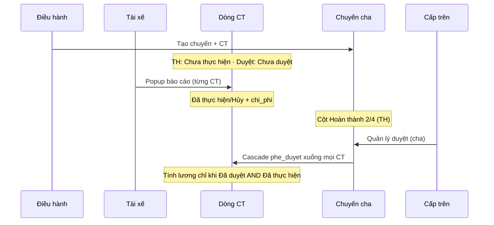

# Chuyến xe — Spec tách Trạng thái thực hiện vs Duyệt

> Tổng hợp owner (Lê Minh Công) qua user, chat 2026-06-15 + thảo luận nội bộ.  
> Thay thế rule cũ “một lớp duyệt” (2026-06-10). File triển khai: checklist theo từng lớp.

## 1. Nguyên tắc cứng (không lẫn lộn)

| # | Rule | Business logic |
|---|------|----------------|
| R1 | **Hai trường riêng** trên CT | `trang_thai` = **TT thực hiện**. `phe_duyet` = **TT duyệt**. Không map chéo, không gộp UI. |
| R2 | **Báo cáo ≠ Duyệt** | Tài xế báo cáo để cấp trên **xem xét**; duyệt do cấp trên, không do tài xế. |
| R3 | **Báo cáo theo phiếu con** | Tài xế thao tác **từng dòng CT** (`vt_chuyen_xe_ct`), không chỉ ghi chú chuyến cha. |
| R4 | **Duyệt theo bảng cha** | Cấp trên duyệt trên **chuyến cha** → trạng thái duyệt **đổ xuống** mọi CT con. |
| R5 | **Cho phép lệch 2 trục** | CT có thể `Đã thực hiện` + `Chưa duyệt` (đã chạy, chưa duyệt tiền) — **chấp nhận**. |
| R6 | **Tính lương = thỏa CẢ HAI** | Chỉ tính vào bảng lương khi CT: `phe_duyet = Đã duyệt` **và** `trang_thai = Đã thực hiện`. Thiếu một trong hai → **không tính**. |
| R7 | **Sửa chi phí** | Điền sai vẫn sửa lại được cho đến khi CT bị khóa **duyệt** (`Đã duyệt` / `Không duyệt`). |

## 2. Giá trị trạng thái (bám schema gốc + template TAH)

### TT thực hiện — `vt_chuyen_xe_ct.trang_thai`

| Giá trị | Ý nghĩa | Ai đổi |
|---------|---------|--------|
| `Chưa thực hiện` | Mặc định khi tạo CT | — |
| `Đang thực hiện` | (Có trong schema gốc; UI tài xế **CAN_HOI_THEM**) | Tài xế? |
| `Đã thực hiện` | Tài xế đã chạy + báo cáo (popup kèm chi phí) | Tài xế |
| `Hủy` / `Không thực hiện` | Không chạy chuyến đó | Tài xế |

Flow tài xế đã chốt: `Chưa thực hiện` → `Đã thực hiện` **hoặc** `Hủy`.

### TT duyệt — cha `vt_chuyen_xe.trang_thai`, con `vt_chuyen_xe_ct.phe_duyet`

| Giá trị | Ý nghĩa |
|---------|---------|
| `Chưa duyệt` | Chờ cấp trên |
| `Đã duyệt` | Đã chốt — khóa sửa CT (theo rule khóa duyệt) |
| `Không duyệt` | Từ chối — khóa sửa CT |

Rollup cha từ con (chỉ **duyệt**): còn CT `Chưa duyệt` → cha `Chưa duyệt`; tất cả đã xử lý và có `Đã duyệt` → cha `Đã duyệt`; còn lại → `Không duyệt`.

## 3. Luồng nghiệp vụ

## 4. Checklist sửa đổi theo từng lớp

### 4.1 Database / Migration

| # | Việc cần làm | Hành vi sau sửa |
|---|--------------|-----------------|
| D1 | **Hoàn nguyên** `vt_chuyen_xe_ct.trang_thai` về TT thực hiện (tách khỏi `phe_duyet`) | Migration đảo `20260610` gộp nhầm: `trang_thai` CT ≠ `phe_duyet`. Default CT: `Chưa thực hiện`. |
| D2 | Giữ `vt_chuyen_xe.trang_thai` = **chỉ duyệt** | Không lưu TT thực hiện trên cha (trừ khi owner bổ sung rollup hiển thị). |
| D3 | Giữ `vt_chuyen_xe_ct.phe_duyet` = **chỉ duyệt** | Cascade từ cha khi duyệt. |
| D4 | Seed/demo: mỗi CT có cặp TH + duyệt độc lập | Ví dụ: `Đã thực hiện` + `Chưa duyệt` được phép. |

### 4.2 Service — `transport-service.ts` và sync helpers

| # | File / hàm | Hiện tại (sai) | Cần sửa thành |
|---|------------|----------------|---------------|
| S1 | `normalizeApprovalStatus` | Map `Đã thực hiện` → `Chưa duyệt` | **Bỏ** map thực hiện vào duyệt; tách `normalizeExecutionStatus`. |
| S2 | `updateTransportRow` (driver) | Chỉ `ghi_chu` cha / `chi_phi` CT, không đổi TH | Driver update: `trang_thai` (TH) + `chi_phi` + `ghi_chu` trên **CT**; không đổi `phe_duyet`. |
| S3 | `setTransportApprovalStatus` / duyệt cha | Modal duyệt lẻ từng CT + rollup | Duyệt **cha** → set `phe_duyet` **đồng loạt** mọi CT; rollup `trang_thai` cha từ `phe_duyet` con. |
| S4 | `applyTripTotals` | Chỉ cộng CT `Đã duyệt` | Tổng lương/phí list: rule riêng — **lương bảng lương** dùng R6 (cả TH + duyệt); cột list cha có thể hiện tổng theo CT đã TH hoặc đã đủ điều kiện lương (chốt khi code). |
| S5 | `syncParentTripsFromChildDetails` | Chỉ sync `trang_thai` duyệt | Giữ rollup **duyệt**; **không** ghi đè `trang_thai` TH của CT. |
| S6 | `isRowLocked` / khóa CT | Khóa theo `phe_duyet` | Khóa sửa khi `phe_duyet ∈ {Đã duyệt, Không duyệt}`; trước đó tài xế sửa `chi_phi` + TH được. |

### 4.3 Sync / stats — `trip-approval-sync.ts`

| # | Hàm | Hiện tại | Cần sửa |
|---|-----|----------|---------|
| T1 | `getTripCtCompletionStats` | Đếm CT **đã duyệt** / tổng | Đếm CT **`Đã thực hiện`** / tổng (cột `ct_hoan_thanh` 2/4, 3/5). |
| T2 | `formatTripCtCompletionStats` | `approved/total` | `executed/total` (label/tooltip: tiến độ thực hiện). |
| T3 | (mới) `isCtEligibleForPayroll` | — | `phe_duyet === 'Đã duyệt' && trang_thai === 'Đã thực hiện'`. |
| T4 | `deriveParentTripStatus` | Rollup duyệt từ `phe_duyet` | Giữ; không dùng `trang_thai` TH. |

### 4.4 Config / cột — `transport-config.ts`

| # | Mục | Cần sửa |
|---|-----|---------|
| C1 | `tripDetails.fields` | Thêm/hiện `trang_thai` (TH) tách `phe_duyet` (duyệt); 2 cột list CT. |
| C2 | `tripDetails.columns` | Cột **Thực hiện** + cột **Phê duyệt** riêng. |
| C3 | `trips.columns` `ct_hoan_thanh` | Đổi tooltip/label → tiến độ **thực hiện** CT. |
| C4 | `lockedWhen` CT | Khóa theo `phe_duyet` (duyệt), không theo TH. |
| C5 | `TRANG_THAI_THUC_HIEN_CHUYEN` | Dùng từ `lib/constants/trang-thai.ts`. |

### 4.5 UI — `TransportModulePage.tsx` (và badge config)

| # | Surface | Hiện tại | Cần sửa — hành vi |
|---|---------|----------|-------------------|
| U1 | Nút tài xế trên list cha | `Báo cáo chuyến` → modal ghi chú cha | Đổi hướng: báo cáo **từng CT** (trong drawer cha hoặc tab CT); popup **TH + chi phí**. |
| U2 | Popup báo cáo tài xế | Chỉ `chi_phi` / `ghi_chu` | Chọn **Đã thực hiện** / **Hủy** + nhập `chi_phi`; confirm trước khi lưu. |
| U3 | `TripChildApprovalDialog` | Duyệt **từng** CT trong modal | Theo R4: duyệt **cha** → cascade; modal cha chọn Duyệt/Không duyệt, **không** duyệt lẻ CT (trừ khi owner đổi ý). |
| U4 | `ApprovalFormDialog` (cha) | Có thể mở từ CT | Chỉ **Quản lý duyệt** từ cha / bulk cha; sau confirm → cascade `phe_duyet`. |
| U5 | Badge list | Một badge duyệt | Cha: badge **duyệt**; cột `2/4`: **thực hiện**. CT: 2 badge/cột tách. |
| U6 | Filter chip | Chỉ filter duyệt | Thêm filter **TT thực hiện** trên tab CT. |
| U7 | `driverReportMode` | `lockedWhen` chuyến `Chưa duyệt` | Tài xế báo cáo CT khi TH còn đổi được; **không** phụ thuộc duyệt (R5). Khóa báo cáo khi CT đã khóa duyệt. |

### 4.6 Bảng lương — `payroll-matrix.ts`, preview, in, export

| # | File | Hiện tại | Cần sửa |
|---|------|----------|---------|
| P1 | `getPayrollTripDetails(..., approvedOnly)` | Chỉ `phe_duyet === Đã duyệt` | Thêm điều kiện `trang_thai === Đã thực hiện` (R6). |
| P2 | `applyPayrollTotals` / `transport-service` payroll | Trip `trang_thai === Đã duyệt` | Trip cha duyệt + CT đủ **cả hai** mới cộng tiền. |
| P3 | Preview / PDF / Excel lương | Filter CT đã duyệt | Filter CT **đủ điều kiện lương** (R6). |
| P4 | Toolbar bảng lương | Nút luôn hiện (đã chốt) | Giữ; chỉ **nội dung** ma trận áp gate R6. |

### 4.7 Phân quyền — `lib/permissions.ts`

| # | Rule |
|---|------|
| Q1 | Tài xế: đổi TH + `chi_phi` CT **của mình**, không đổi `phe_duyet`. |
| Q2 | `kiem_tra`: duyệt trên **cha**, cascade xuống CT. |
| Q3 | `isRowLocked`: theo **duyệt**, không chặn báo cáo TH chỉ vì chưa duyệt. |

### 4.8 Test / E2E

| # | Việc |
|---|------|
| E1 | Sửa `trip-approval-sync.test.ts`: stats đếm **thực hiện**, không duyệt. |
| E2 | Thêm test R6: CT `Đã thực hiện`+`Chưa duyệt` → không vào lương; cả hai → có. |
| E3 | `production-multi-role.spec.ts`: flow tài xế popup TH+phí; manager duyệt cha cascade. |

## 5. Ma trận trạng thái CT (tham chiếu nhanh)

| TT thực hiện | TT duyệt | Hiển thị list | Tài xế sửa phí/TH | Tính lương |
|--------------|----------|---------------|-------------------|------------|
| Chưa thực hiện | Chưa duyệt | Bình thường | Có | Không |
| Đã thực hiện | Chưa duyệt | OK (R5) | Có | **Không** |
| Đã thực hiện | Đã duyệt | OK | Không (khóa) | **Có** |
| Hủy | * | — | Theo khóa duyệt | Không |
| Đã thực hiện | Không duyệt | — | Không | Không |

## 6. Nguồn owner

- Chat nhóm 5F, Lê Minh Công, 2026-06-15: hai trường riêng; lương cần **cả hai**; duyệt cha / báo cáo con.
- File phối hợp: [Google Sheet](https://docs.google.com/spreadsheets/d/1bCV-0vN0RbNJTk0STTRGb-eexavah2Wus2p8SxneSrc/edit?gid=0#gid=0)
- Schema tham chiếu: `supabase/migrations/20260530_initial_app_schema.sql`

## 7. Mở (CAN_HOI_THEM)

- UI tài xế có bước `Đang thực hiện` hay nhảy thẳng `Chưa` → `Đã` / `Hủy`? (Hiện: popup chỉ **Đã thực hiện** / **Hủy**; quản lý vẫn set `Đang thực hiện` trên form CT.)

**Đã chốt (không còn mở):**

- Duyệt **chỉ từ chuyến cha** — đã bỏ nút/modal duyệt lẻ CT (`5f653e9a`).

## 8. Trạng thái triển khai (đóng 2026-06-15)

> Checklist §4 = spec. **Shipped** = repo + DB production + harness. Verify UI: `14-production-e2e-harness.md` §0.

| ID | Shipped | Ghi chú |
|----|---------|---------|
| D1–D4 | Có | `20260615_restore_trip_execution_status.sql` — **đã apply** production |
| D5 | Có | `20260615_payroll_trigger_execution_gate.sql` — trigger R6 + recalc `vt_luong` |
| S1–S6 | Có | `getTripTotalsById` khớp `applyTripTotals` (`5f653e9a`) |
| T1–T4 | Có | `getTripCtCompletionStats` đếm executed; `isCtEligibleForPayroll` |
| C1–C5 | Có | `transport-config.ts`, `approval-badge-config.ts`, `trang-thai.ts` |
| U1–U7 | Có | **Báo cáo CT**; duyệt cha only; không `TripChildApprovalDialog` |
| P1–P4 | Có | `payroll-matrix.ts`, preview/PDF/Excel + trigger DB R6 |
| Q1–Q3 | Có | `lib/permissions.ts` + service gates |
| E1–E3 | Có | Unit + `production-trip-execution.spec.ts`; fixture `payrollEligibleCtCount: 0` |
| — | Ngoài scope | `TransportReportPage` (thống kê) — owner chấp nhận tạm |