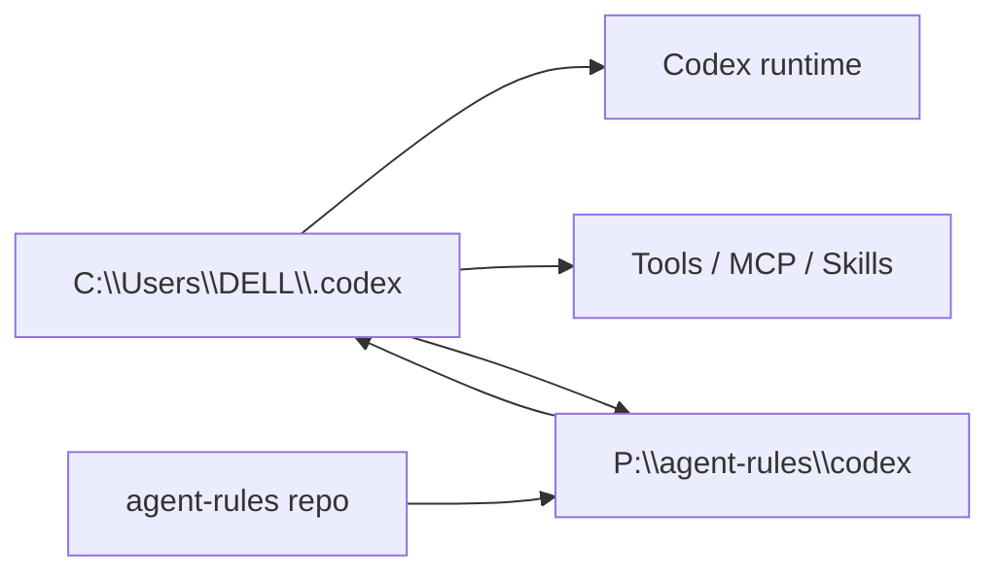

# Agent Rules — Đặc Tả Kỹ Thuật

> **Mục đích:** Giải thích tại sao repo này được tổ chức như một runtime Codex có thể đồng bộ, không chỉ liệt kê file rule và skill.

## 1. Tổng quan

`agent-rules` là bộ điều khiển vận hành cho Codex trên máy Windows. Nó gom rule, profile, skill, script, template và inventory thành một bundle có thể copy, sync và phục hồi. Điểm quan trọng nhất là repo này không phải ứng dụng chạy cho người dùng cuối; nó là hệ thống kiểm soát cách agent làm việc.

Luận điểm thiết kế: **runtime hằng ngày phải nằm local để ổn định, nhưng cấu hình phải có bản backup/versioned để phục hồi được**. Vì vậy `C:\Users\DELL\.codex` là nguồn dùng hằng ngày, còn `P:\agent-rules\codex` là bản đồng bộ để backup, bootstrap máy mới và chia sẻ với agent/tool khác.

## 2. Runtime model



`Local` là runtime thật khi Codex chạy. `Backup` là bản sao để khôi phục hoặc sync. Repo giữ cả hai tầng: các loader tương thích ở root và bundle đầy đủ trong `codex/`.

## 3. Cấu trúc hệ thống

| Khu vực | Vai trò | Lý do tồn tại |
|---|---|---|
| `codex/AGENTS.md` | Điểm nạp runtime | Cho Codex biết phải đọc rule nào trong `C:\Users\DELL\.codex` |
| `codex/rules/` | Hợp đồng hành vi | Tách planning, execution, quality gate, context và inventory thành từng lớp rõ |
| `codex/agents/` | Profile TOML | Chọn model, effort và sandbox theo pha làm việc |
| `codex/skills/` | Quy trình chuyên biệt | Đóng gói workflow như docs, research, Playwright, UI quality, security |
| `codex/scripts/` | Tự động hóa Windows | Sync, bootstrap, inventory và phase orchestration bằng PowerShell |
| `codex/docs/` | Registry runtime | Ghi lại tool, MCP, skill, profile và cách bootstrap |
| `codex/templates/` | Mẫu artifact | Chuẩn hóa plan, research, review, handoff và final report |
| `codex/inventory/` | Snapshot máy | Ghi tool/path/env/config hiện có mà không lưu secret |

## 4. Luồng nạp rule

```text
User request
  -> Codex reads AGENTS.md
  -> AGENTS imports runtime rules under C:\Users\DELL\.codex
  -> rules classify risk and workflow
  -> plan/research/implement/review profile is chosen
  -> scripts and skills support the selected phase
```

Thiết kế này giữ rule ở dạng Markdown để người dùng đọc và sửa được. Các quyết định chạy thật như model, effort hoặc profile không bị chôn trong văn bản; chúng nằm trong TOML và script để có thể kiểm tra bằng lệnh.

## 5. Phase/profile orchestration

Repo không cố làm Codex tự đổi agent một cách ẩn. Thay vào đó, nó ghi phase/profile vào plan và dùng script để resolve.

| Pha | Profile | Mục đích |
|---|---|---|
| Plan | `planner` | Lập locked plan, không sửa code |
| Research | `researcher` | Thu thập bằng chứng trước khi implement |
| Implement | `implementer` | Thực thi một plan file và verify |
| Bugfix | `bugfixer` | Debug khi lỗi chưa rõ |
| Review | `reviewer` / `reviewer-highrisk` | Rà soát correctness, scope, verification |

Các script chính:

- `resolve-workflow-profile.ps1`: map phase/risk thành profile.
- `start-codex-phase.ps1`: tạo lệnh Codex theo phase.
- `resolve-plan-profile.ps1`: đọc plan file để chọn profile.
- `start-codex-from-plan.ps1`: chạy Codex từ plan file.

## 6. Quyết định kỹ thuật

### Decision: Local runtime trước, backup sau

**Vấn đề:** Nếu Codex phụ thuộc trực tiếp vào ổ backup hoặc repo đang sync, công việc hằng ngày dễ bị gãy khi path biến mất hoặc repo chưa cập nhật.

**Chọn:** Dùng `C:\Users\DELL\.codex` làm runtime chính, `P:\agent-rules\codex` làm bản backup/bootstrap.

**Không chọn:** Dùng `P:\agent-rules` làm runtime trực tiếp.

**Đánh đổi:** Phải có script sync hai chiều và phải nhớ sync sau khi thay đổi runtime.

**Xem lại khi:** Codex hỗ trợ một cơ chế managed runtime/versioning tốt hơn.

### Decision: Markdown rule + TOML profile

**Vấn đề:** Rule cần dễ đọc, nhưng cấu hình model/profile cần cấu trúc rõ và chạy được bằng tool.

**Chọn:** Rule viết bằng Markdown; profile viết bằng TOML.

**Không chọn:** Dồn mọi thứ vào một file prompt lớn.

**Đánh đổi:** Người bảo trì phải hiểu hai lớp: rule mô tả hành vi, profile chọn runtime.

### Decision: PowerShell là lớp automation chính

**Vấn đề:** Runtime này chạy trên Windows, thao tác path, sync và verify cần dùng công cụ phù hợp hệ điều hành.

**Chọn:** PowerShell script cho bootstrap, sync, inventory và orchestration.

**Không chọn:** Bash-only workflow.

**Đánh đổi:** Khi chuyển sang Linux/macOS cần viết lại hoặc thêm script tương đương.

## 7. Registry và inventory

Registry trong `codex/docs/` giải thích thứ gì đang được cài và cách dựng lại. Inventory trong `codex/inventory/` ghi snapshot máy hiện tại: tool, path, env, MCP list và config snapshot.

Điểm cần giữ: inventory được phép ghi tên biến môi trường và path, nhưng không được ghi secret value. Đây là lý do các docs về MCP/tool chỉ mô tả nơi cấu hình và cách verify, không nhúng token.

## 8. Rủi ro vận hành

| Rủi ro | Dấu hiệu | Cách xử lý |
|---|---|---|
| Runtime local lệch backup | Skill/rule chạy khác với bản repo | Chạy `sync-codex-to-p.ps1` sau khi sửa runtime |
| Backup cũ ghi đè runtime mới | Mất skill/rule vừa chỉnh | Chỉ chạy restore khi biết rõ nguồn cần lấy |
| MCP stale | Tool trả dữ liệu cũ hoặc thiếu index | Dùng `gitnexus-preflight.ps1`, fallback `rg` |
| Plan quá lớn | Agent mất scope hoặc sửa lan | Dùng plan folder chia slice liên tục |
| Secret lọt vào inventory | Repo chứa token/key | Xóa ngay, rotate secret, chỉ giữ tên biến |

## 9. Phụ lục: file quan trọng

| File | Vai trò |
|---|---|
| `codex/rules/core.md` | Quy tắc nền và hợp đồng thực thi |
| `codex/rules/planning.md` | Chuẩn locked plan và slice |
| `codex/rules/execution.md` | Quy trình thực thi và final report |
| `codex/rules/quality-gates.md` | Risk tier và verification tier |
| `codex/docs/phase-orchestration.md` | Cách map phase sang profile |
| `codex/docs/bootstrap-new-machine.md` | Cách dựng lại runtime trên máy mới |
| `codex/scripts/verify-codex-rules.ps1` | Kiểm tra file runtime bắt buộc |
| `codex/scripts/sync-codex-to-p.ps1` | Sync runtime local sang backup |
| `codex/scripts/sync-p-to-codex.ps1` | Restore backup về runtime local |
